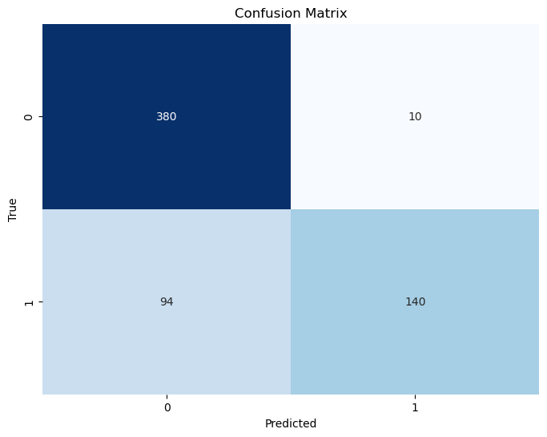
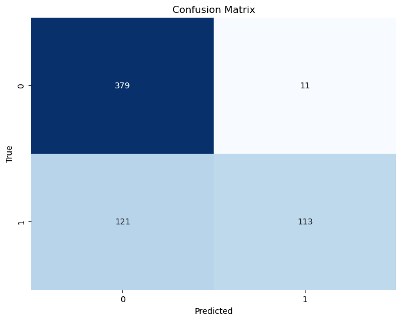
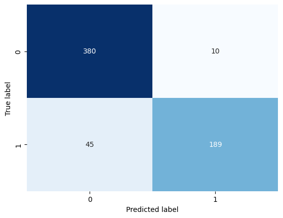

# pneumonia-detection-XRay

## Overview
This project's focus was the creation of accurate classifiers using both classic Machine Learning and Deep Learning methods, for the identification of Pneumonia on X-Ray images of lungs. The dataset was provided on Kaggle ( https://www.kaggle.com/paultimothymooney/chest-xray-pneumonia ) and consisted of 5,863 X-Ray images (JPEG) and 2 categories (Pneumonia (1) / Normal (0)). The Pneumonia case had a further categorization in cases caused either by virus or bacterial infection. For this project, the problem was approached as a two-class problem, concerning the identification or not of pneumonia on the test set.

## Classic Machine Learning
Three different approaches were performed. The first approach involved the application of dimensionality reduction techniques directly to the images to discern possible separation planes. The second involved the extraction of one feature and subsequent dimensionality reduction. The third one involved the extraction of 7 features and no ensuing dimensionality reduction. The best results were yielded by the third one. Four different dimensionality reduction techniques were tested (PCA, Truncated SVD, tSNE, UMAP) and four different classifiers (SVM-linear kernel, Logistic Regression, Random Forest, XGBoost). In all cases hyperparameter tuning under the Bayesian framework ensued, utilizing the Optuna package. XGBoost was the best performing classifier during the validation process (MCC score: 0.71). On the test set, SVM seemed to result in less misclassifications and better scores overall (macro averages of precision, recall, F1-score: 0.87, 0.79, 0.80, accuracy 0.83) but the results between the two were pretty close.  More details about the results and the operations performed can be found in the respective section of the notebook. The images below depict the confusion matrices on the test set for both SVM (left image) and XGBoost (right image).

  
  

## Deep Learning
Two pretrained CNN-based models (DenseNet169, MobilenetV2) were stacked together. The stacked model was trained for 20 epochs. The results of the model were superior to those of the classic ML algorithms. It achieved macro average scores for precision, recall and F1-score of  0.92, 0.89, 0.90 respectively and an accuracy score of 0.91. Only 55 (45 for the pneumonia class, 10 for the normal class) out of the 624 total test instances were misclassified, making its results far more accurate, while also showcasing an ability of managing the class imbalance. The image below depicts the confusion matrix on the test set for the stacked model.

  

## Conclusion
All in all, the Deep Learning model outperformed all classic ML models and managed to handle the class imbalance efficiently, not favoring the more abundant normal class. The pneumonia class would be more important to identify correctly in new X-Ray images in a medical setting, as wrongly classified images (mistaken as normal cases) could have an adverse effect for a patient that wouldn't receive pneumonia appropriate care in due time. It should be noted however that the classic ML models are more easily interpretable, which could also be of great importance in a medical setting, should their performance in correctly classifying the pneumonia class increase.

## Future work
Both methods could be expanded to accomodate the subclasses of the Pneumonia class (bacterial, virus infection) in order to result in more advanced and informative classifiers.
